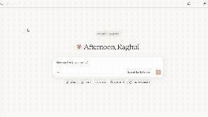
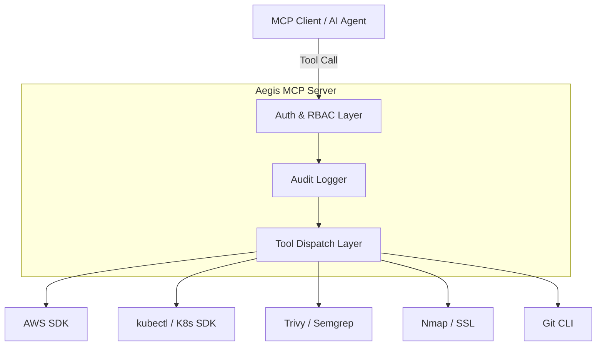

<div align="center">
  
  <h1>🛡️ Aegis MCP Server</h1>
  <p><b>Aegis MCP is an open-source, DevSecOps-focused Model Context Protocol server that allows AI agents to safely interact with cloud infrastructure, CI/CD systems, and security tooling.</b></p>

  [](https://opensource.org/licenses/MIT)
  [](https://www.python.org/downloads/)
  [](https://modelcontextprotocol.io/)
  [](https://www.docker.com/)
</div>

---

**Aegis MCP Server** empowers AI assistants (like Claude, Cursor, and GitHub Copilot) to perform cloud architecture administration, security scanning, and network analyses directly from their execution environments. It wraps powerful underlying tools and SDKs into secure, audited MCP tool sets.

---

## 📸 Demo in Action

```text
AI Agent: "Check if any S3 bucket is publicly accessible"

Tool call → aws_check_s3_public_access
Result → bucket audit report
```

<p align="center">
  
</p>

---

## 🌟 Key Features

- 🚀 **FastMCP Server** — Exposes domain-specific tools for AWS, Kubernetes, security scanning, Git, network analysis, and CI/CD pipelines.
- 🔐 **Flexible Authorization** — JWT-based RBAC for production deployments; automatically disabled for local stdio sessions (Claude Desktop, Agent IDEs).
- 📜 **Structured Audit Logging** — Emits clean JSON audit logs for every invocation, suitable for SIEM integrations.
- 🛠 **Expandable Tooling** — Easily add new integrations. Includes ready-to-use scanners for dependencies, secrets, SSL/TLS certs, Semgrep, Trivy, and more.
- 📦 **Docker Ready** — Containerized deployment using a non-root runtime with built-in health checks.
- 🌐 **ASGI Integration** — FastAPI health endpoint alongside MCP streamable-http transport.

---

## 📐 Architecture



The server receives MCP tool-call requests over **streamable HTTP** or **stdio** transport. In HTTP mode, each request requires a JWT bearer token for authorization. In stdio mode (local usage), authorization is automatically disabled.

---

## 📂 Repository Structure

```text
aegis-mcp/
│
├── server/
│   ├── main.py
│   ├── health.py
│   ├── auth.py
│   └── tools/
│       ├── aws/
│       ├── kubernetes/
│       ├── security/
│       └── network/
│
├── policies/
├── tests/
├── Dockerfile
└── run_stdio.py
```

---

## 🧰 Available Tools

### Example Tool Invocation

```text
Tool: security_run_trivy_scan

Input:
image=nginx:latest

Output:
CRITICAL: 2
HIGH: 4
MEDIUM: 7
```

### Cloud & DevOps
| Tool | Description |
|------|-------------|
| `aws_list_ec2_instances` | List EC2 instances in a specific AWS region |
| `aws_check_s3_public_access` | Audit S3 buckets for public access settings |
| `k8s_list_pods` | List Kubernetes pods in a given namespace |
| `cicd_pipeline_status` | Fetch CI/CD pipeline execution status |
| `git_recent_commits` | Fetch recent commit history from the active Git repo |

### Application Security & SAST
| Tool | Description |
|------|-------------|
| `security_semgrep_scan` | Run Semgrep SAST scan on a local directory or file |
| `security_run_trivy_scan` | Run Trivy vulnerability scan on a container image |
| `security_scan_secrets` | Scan files/directories for exposed secrets |
| `security_check_dependencies` | Check dependency files for known CVEs via OSV.dev |

### Network & Infrastructure Security
| Tool | Description |
|------|-------------|
| `k8s_security_audit` | Audit Kubernetes clusters (privileged containers, wildcard RBAC, etc.) |
| `network_port_scan` | TCP port scan to detect exposed services |
| `security_check_ssl_certificate` | Validate SSL/TLS certificate details and expiry |
| `security_check_http_headers` | Audit URLs for security headers (HSTS, CSP, etc.) |

> [!IMPORTANT]
> **SAST (Semgrep scan) works only on Agent IDEs (e.g., Antigravity, Cursor) or Claude Co-work.**
> It does **not** work on Claude Desktop due to Windows subprocess pipe limitations with `semgrep-core.exe`. All other tools (secrets scan, SSL check, port scan, etc.) work on all platforms including Claude Desktop.

---

## 🚀 Getting Started

### Prerequisites

- **Python 3.12+**
- **Node.js 18+** (only if you want to run via npm/npx)
- **Semgrep** — `pip install semgrep` (for SAST scanning)
- Optional: AWS CLI / `boto3`, `kubectl`, Trivy (for their respective tools)

### Installation

```bash
git clone https://github.com/raghulvj01/aegis-mcp.git
cd aegis-mcp

# Create virtual environment
python -m venv .venv

# Activate it
# Linux/Mac:
source .venv/bin/activate
# Windows:
.venv\Scripts\activate

# Install dependencies
pip install -r requirements.txt
```

### Install via npm (Public Package)

```bash
npm install -g @raghulm/aegis-mcp
# or run without installing globally:
npx -y @raghulm/aegis-mcp
```

On first run, the npm wrapper creates a local Python virtual environment and installs dependencies from `requirements.txt` automatically.

---

## 🤖 Usage with AI Agents

### Agent IDE / Antigravity (Recommended)

Add to your MCP config (e.g., `mcp_config.json`):

```json
{
  "mcpServers": {
    "aegis": {
      "command": "npx",
      "args": ["-y", "@raghulm/aegis-mcp"]
    }
  }
}
```

> ✅ **All 12 tools work**, including Semgrep SAST.

### Claude Desktop

Add to `claude_desktop_config.json`:
- **Windows**: `%LOCALAPPDATA%\Packages\Claude_...\LocalCache\Roaming\Claude\`
- **Mac**: `~/Library/Application Support/Claude/`

```json
{
  "mcpServers": {
    "aegis": {
      "command": "npx",
      "args": ["-y", "@raghulm/aegis-mcp"]
    }
  }
}
```

> ⚠️ **11 of 12 tools work.** Semgrep SAST does not work due to Windows pipe limitations.

### Cursor / Windsurf (HTTP Mode)

Start the server, then add to `.cursor/mcp.json`:

```bash
uvicorn server.health:app --host 0.0.0.0 --port 8000
```

```json
{
  "mcpServers": {
    "aegis": {
      "url": "http://localhost:8000/mcp"
    }
  }
}
```

### Docker Deployment

```bash
docker build -t aegis-mcp .
docker run -p 8000:8000 aegis-mcp
```

### Telegram Bot (MCP Test Bridge)

You can quickly test your MCP server from Telegram with `run_telegram_bot.py`.

1. Create a bot with [@BotFather](https://t.me/BotFather) and copy the token.
2. Start the MCP server in HTTP mode:

```bash
uvicorn server.health:app --host 0.0.0.0 --port 8000
```

3. Set environment variables and run the bot:

```bash
# Linux/Mac
export TELEGRAM_BOT_TOKEN="<bot-token>"
export MCP_SERVER_URL="http://127.0.0.1:8000/mcp"
export TELEGRAM_ALLOWED_CHAT_IDS="<your-chat-id>"
export MISTRAL_API_KEY="<your-mistral-key>" # required for /ask
python run_telegram_bot.py

# Windows PowerShell
$env:TELEGRAM_BOT_TOKEN="<bot-token>"
$env:MCP_SERVER_URL="http://127.0.0.1:8000/mcp"
$env:TELEGRAM_ALLOWED_CHAT_IDS="<your-chat-id>"
$env:MISTRAL_API_KEY="<your-mistral-key>"   # required for /ask
python .\run_telegram_bot.py
```

Telegram commands:

- `/health` - Check MCP health endpoint
- `/tools` - List available MCP tools
- `/call <tool_name> <json_args>` - Call a tool
- `/ask <question>` - Use Mistral AI to pick and execute an MCP tool

Example:

```text
/call security_check_ssl_certificate {"hostname":"example.com"}
/ask check SSL certificate expiry for example.com
```

---

## ⚙️ Configuration

| Variable | Description | Default |
|----------|-------------|---------|
| `MCP_AUTH_DISABLED` | Disable JWT auth (auto-set for stdio) | `false` |
| `MCP_SERVICE_NAME` | Name of the MCP service | `aegis` |
| `MCP_ENV` | Environment (`dev`, `staging`, `prod`) | `dev` |
| `MCP_ROLES_FILE` | Path to roles policy YAML | `policies/roles.yaml` |
| `MCP_SCOPES_FILE` | Path to scopes policy YAML | `policies/scope_rules.yaml` |
| `OIDC_ISSUER` | Expected JWT `iss` claim | *None* |
| `OIDC_AUDIENCE` | Expected JWT `aud` claim | *None* |

---

## 🗝 Access Control

In **HTTP mode**, every tool requires a `token` argument containing a JWT. The authorization layer checks roles and scopes defined in `policies/roles.yaml` and `policies/scope_rules.yaml`.

In **stdio mode** (local usage via `run_stdio.py`), authorization is **automatically disabled** — no token required.

### Policy Example (`policies/roles.yaml`)

```yaml
roles:
  viewer:
    - aws_list_ec2_instances
    - k8s_list_pods
  security:
    - security_run_trivy_scan
    - security_semgrep_scan
  admin:
    - aws_list_ec2_instances
    - k8s_list_pods
    - security_run_trivy_scan
    - security_semgrep_scan
    # ... all tools
```

---

## 📝 Audit Logging

The `@audit_tool_call` decorator emits structured JSON logs for every invocation:

```json
{
  "timestamp": "2026-03-06T08:00:01+00:00",
  "level": "INFO",
  "event": "tool_call_succeeded",
  "tool": "security_run_trivy_scan",
  "duration_ms": 1204
}
```

---

## 🛡️ Security Best Practices

1. **Enforce JWT Signature Validation** — Update `server/auth.py` to verify RS256 JWTs using your IdP's JWKS endpoint for production.
2. **Least-Privilege Credentials** — Assign ReadOnly IAM / K8s roles to the server environment.
3. **Monitor Audit Logs** — Forward JSON logs to a SIEM. Set up anomaly detection for aggressive looping.

---

## 🛣️ Roadmap

- [ ] Terraform security scanner
- [ ] IAM policy risk detection
- [ ] Kubernetes misconfiguration scanner (Basic `k8s_security_audit` implemented!)
- [ ] GitHub Actions security audit
- [ ] Cloud cost analysis tools

---

## 🤝 Contributing

See [CONTRIBUTING.md](./CONTRIBUTING.md) for contribution and maintainer release workflows.

---

## 📄 License

Distributed under the MIT License. See `LICENSE` for more information.
